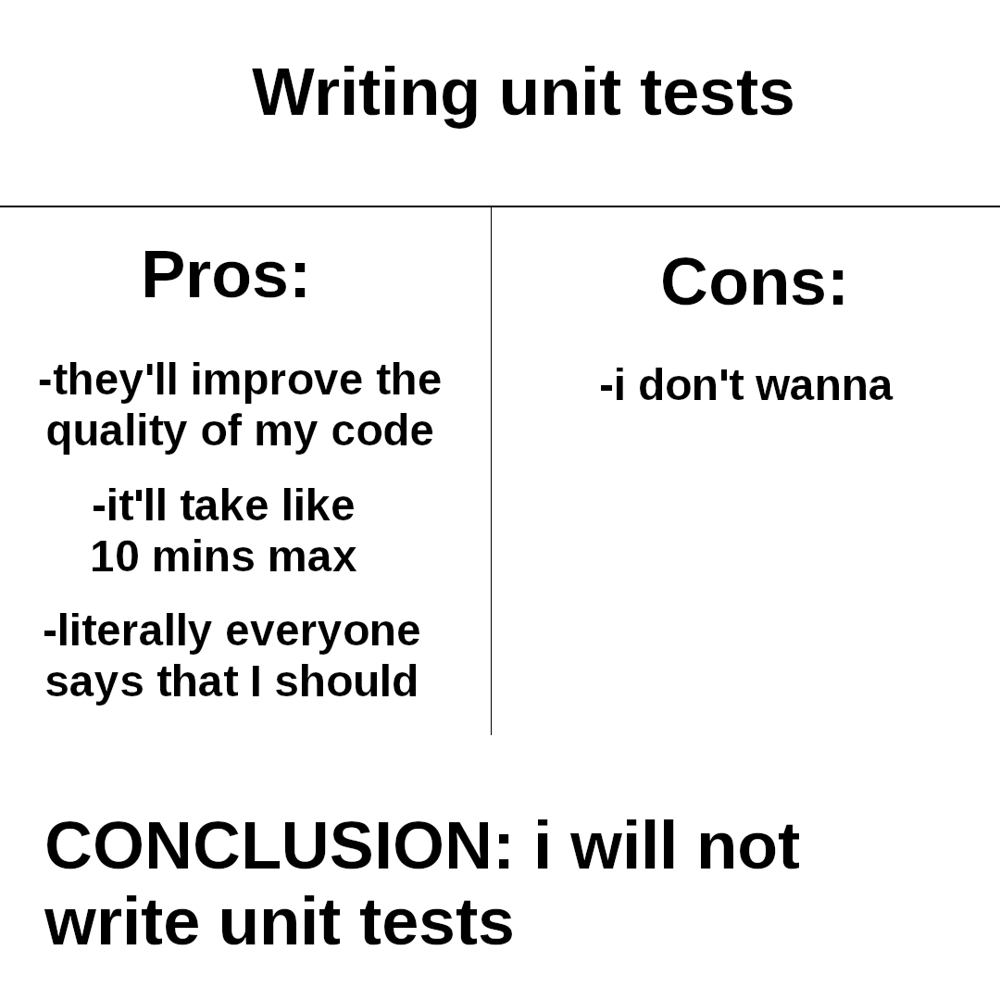

# Pytest introduction and demo

## Introduction
### Goals
- Remove percieved complexity of unittesting your code.
- Explain why to test your code.
- Show how to test your code.

### Why test your code?
- Unit testing allows you to know if your code works.
- It allows you to know if your code breaks.
- It allows you to know if your code is broken.
- Unit testing also saves you a lot of time -- "Debugging is hard, testing is easy"
- Testing allows you to refactor your code with confidence -- The input and output of your methods/functions, classes or even pipelines are well defined and automatically tested.
- You will gain a better understanding of your code and how it works. Unit testing forces you to think in terms of inputs and outputs and what you expect from your code.
- Testing makes your code easier to understand and maintain. It is easier to understand what your code does when you have a set of tests that define what your code should do. Anyone new can easily see the expected behaviour of your code.
- Testing preserves serious resources -- it saves time spent in debugging and allows easier industrialisation of your code. New engineers can easily understand your code, make changes to it and know when they break something unintentionally.




## How to test your code
Pytest is a testing framework for Python. It allows you to write tests quickly and run them easily. It is a great tool for testing your code and making sure it works as expected.

### Installation
Pytest can be installed using pip:
```bash
pip install pytest
```

### Why pytest?
- It is easy to use and understand.
- Very little boilerplate code.
- It is very flexible and allows you to write tests in a variety of ways.
- Test filtering.
- Parametrization.
- Open Source & Large community.

### How to use pytest?
With pytest you create a folder `tests` and put all your tests in there. Pytest will find the tests folder (otherwise put a `conftest.py` in your root) You can then run all your tests using the command from your workspace:
```bash
pytest
```

You can also integrate pytest with your IDE. In VSCode you open your command pallete `ctrl/cmd+shift+p` and type `tests`. You then enable it for Python. In PyCharm you can do this by going to `Preferences > Tools > Python Integrated Tools > Default test runner` and selecting `pytest`.

A test is a function that starts with `test_` and takes no arguments. You can then use the `assert` keyword to check if your code works as expected. For example:
```python
def test_add():
    assert add(1, 2) == 3
```
Most tests are structured as Arrange, Act, Assert. This means you first arrange your test, then you act on it and finally you assert that the result is as expected. Or given... when... then. For example:
```python
def test_add():
    # Arrange / Given
    a = 1
    b = 2
    # Act / When
    result = add(a, b)
    # Assert / Then
    assert result == 3
```
Any time you make changes to your code you can run your tests to make sure you didn't break anything. You can also run your tests before you commit your code to make sure you didn't break anything. Ideally your remote repository should have a CI/CD pipeline that runs your tests before allowing you to commit into a branch.  


# Further reading

Recommended resources for testing with pytest:

[pytest documentation (rtfm)](https://docs.pytest.org/en/latest/)

[guru99 pytest tutorial](https://www.guru99.com/pytest-tutorial.html)

[datacamp hands on guide](https://www.datacamp.com/tutorial/pytest-tutorial-a-hands-on-guide-to-unit-testing)

[realpython - pytest](https://realpython.com/pytest-python-testing/)

[semaphore - pytest](https://semaphoreci.com/community/tutorials/testing-python-applications-with-pytest)

[advanced CI with pytest](https://www.youtube.com/watch?v=DhUpxWjOhME)

[sci-kit learn testing](https://github.com/scikit-learn/scikit-learn/tree/main/sklearn/ensemble/tests)

[pandas testing](https://github.com/pandas-dev/pandas/tree/main/pandas/tests)